# WIS2Box ADL ADCON Plugin

[WIS2Box ADL](https://github.com/wmo-raf/wis2box-adl) Plugin for automated observation data loading from ADCON AWS
Network into the WIS2Box

## Introduction

[WIS2Box Automated Data Loader](https://github.com/wmo-raf/wis2box-adl) is a Wagtail based web application that provides
functionality for automating periodic Observation data ingestion into WIS2Box node, from Automatic and or Manual
Weather Stations. ADL is a plugin based system that defines an architecture for implementing wis2box data loaders for
different AWS vendors.

This plugin is an implementation of the ADL plugin for the ADCON AWS Network. The goal is to provide
functionality to ingest data from ADCON AWS Network into the WIS2Box.

## Installation

This plugin contains Django/Wagtail app that should be installed in the WIS2Box ADL project. This means that you need to
have the WIS2Box ADL project installed and running before you can install this plugin.

### 1. Install and set up the ADL Project

ADL is the core project where plugins can be installed.

For installation of the WIS2Box ADL project, please refer to the [WIS2Box ADL](https://github.com/wmo-raf/wis2box-adl)
documentation.

### 2. Add the plugin to the WIS2Box ADL project

At the root of the `wis2box-adl`, edit the `.env` file and add the following line:

```sh
WIS2BOX_ADL_PLUGIN_GIT_REPOS="https://github.com/wmo-raf/wis2box-adl-adcon-plugin.git"
```

The `WIS2BOX_ADL_PLUGIN_GIT_REPOS` is a comma separated list of git repositories that contain the ADL plugins. If there
is an existing plugin url, add the new plugin repository to the list separated by a comma.

### 3. Add custom environment variables

`wis2box-adl-adcon-plugin` requires the following environment variables to be set:

```sh
WIS2BOX_ADL_ADCON_DATABASE_URL=
WIS2BOX_ADL_ADCON_INIT_DATETIME=
```

These should be added to the `.env` file in the root of the `wis2box-adl` project.

| Variable                        | Description                                                                                                                                         | Example                                         | Required |
|---------------------------------|-----------------------------------------------------------------------------------------------------------------------------------------------------|-------------------------------------------------|----------|
| WIS2BOX_ADL_ADCON_DATABASE_URL  | Full ADCON addVANTAGE PostgreSQL database connection string                                                                                         | postgres://postgres:postgres@ip:port/addvantage | YES      |
| WIS2BOX_ADL_ADCON_INIT_DATETIME | The initial date-time to start from, when querying data from ADCON database. Leave blank to use the current system time when the plugin initializes | 2024-10-29 00:00                                | NO       |

#### Getting the ADCON Database URL

The ADCON database URL is the connection string to the PostgreSQL database where the ADCON addVANTAGE data is stored.
ADCON addVANTAGE is a software that is used to manage and visualize the ADCON AWS Network. The data is stored in a
PostgreSQL database, usually installed on a Windows server.

To make the database accessible by the WIS2Box ADL, we need to make the following configurations on the Windows server:

1. Update addVANTAGE PostgreSQL configurations to allow remote connections.
2. Update Windows Firewall to allow incoming connections to the PostgreSQL port.
3. Restart the PostgreSQL service.

##### 1. Update addVANTAGE PostgreSQL configurations

The PostgreSQL database that comes with addVANTAGE is usually installed with default configurations that only allow
local connections. To allow remote connections, we need to update the `pg_hba.conf`  and `postgresql.conf` files.

The location of the `pg_hba.conf` and `postgresql.conf` can vary depending on how the installation was done. Make sure
you find the correct location of these files.

Below is an example screenshot of such a location on a Windows server:

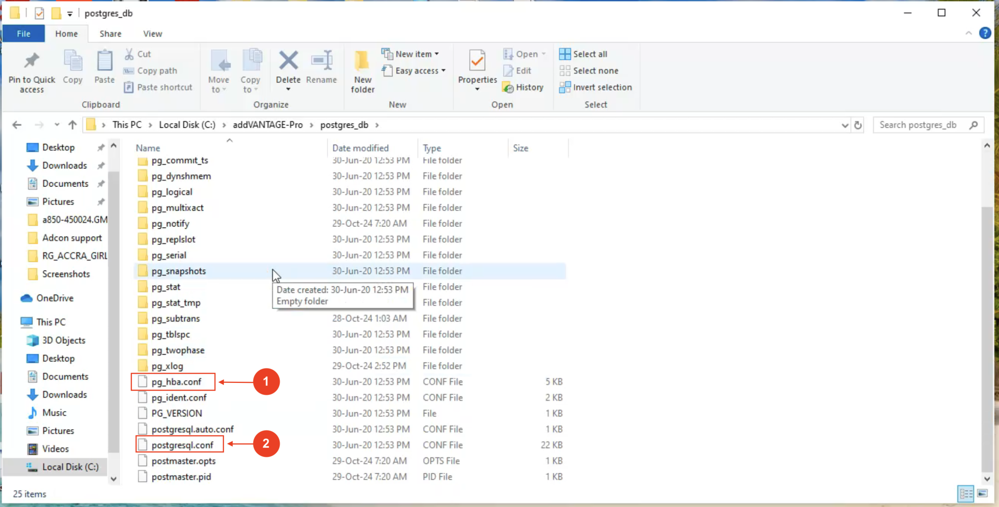

If you are not sure of the location, check the running services on the Windows server to find the PostgreSQL service.
Then look at its properties and the command used to start the service. This will point you to where you might expect to
find the configuration files.

The `pg_hba.conf` file is used to control client authentication. We need to add a new line to allow connections from the
WIS2Box ADL server.

Under the `IPv4 local connections` section, add the following line to the existing lines:

```conf
host    all             all             <ADL_SERVER_IP>/32            trust
```

Replace `<ADL_SERVER_IP>` with the IP address of the WIS2Box ADL server and save the file.

The `postgresql.conf` file is used to control the server configuration. We need to update the `listen_addresses` to
allow connections from the WIS2Box ADL server.

Find the line #listen_addresses = 'localhost' and uncomment it (remove the # character at the beginning of the line).

```conf
listen_addresses = '*'
```

##### 2. Configure the Windows Firewall to allow incoming connections to PostgreSQL

1. Launch Windows Control Pane
2. Open Windows Defender Firewall
3. Click Advanced settings on the left side of the window
4. Click Inbound Rules on the left side of the window
5. Click New Rule on the right side of the window
6. Select Port as the type of rule and click Next
7. Select TCP and specify the port number used by the PostgreSQL database (default is 5432) and click Next
8. Select Allow the connection and click Next
9. Select the network types to apply the rule (Domain, Private, or Public) and click Next
10. Enter a name and description for the rule and click Finish

After completing these steps, remote connections to PostgreSQL should be allowed on the Windows machine.

##### 3. Restart the PostgreSQL service

After making the changes to the PostgreSQL configurations, restart the PostgreSQL service to apply the changes.

1. Open the Windows Services Manager
2. Find the PostgreSQL service and right-click on it. This could be named something like `ADCON PostgreSQL` or similar.
3. Click Restart

The connection string should look something like this:

```sh
WIS2BOX_ADL_ADCON_DATABASE_URL=postgres://postgres:postgres@<ADCON_SERVER_IP>:5432/addvantage
```

Replace `<ADCON_SERVER_IP>` with the IP address of the Windows server where the PostgreSQL database is installed.

### 4. Update Docker Compose configuration

After adding the variables to the `.env` file, we need to update our `docker compose` configuration to include these new
variables. We do not want to edit the core `docker-compose.yml` file, instead we will create a new file
called `docker-compose.override.yml`in the root of the `wis2box-adl` project.

You can copy the sample `docker-compose.override.sample.yml` file:

```shell
cp docker-compose.override.sample.yml docker-compose.override.yml
```

The contents of the `docker-compose.override.yml` file should look like this:

```yaml
x-backend-variables: &backend-variables
  WIS2BOX_ADL_ADCON_DATABASE_URL: ${WIS2BOX_ADL_ADCON_DATABASE_URL}
  WIS2BOX_ADL_ADCON_INIT_DATETIME: ${WIS2BOX_ADL_ADCON_INIT_DATETIME}

services:
  wis2box_adl:
    environment:
      <<: *backend-variables
    extra_hosts:
      - "host.docker.internal:host-gateway"
  wis2box_adl_celery_worker:
    environment:
      <<: *backend-variables
    extra_hosts:
      - "host.docker.internal:host-gateway"

  wis2box_adl_celery_beat:
    environment:
      <<: *backend-variables
    extra_hosts:
      - "host.docker.internal:host-gateway"
```

Save the file and run the following command to restart the WIS2Box ADL services:

```shell
docker compose -f docker-compose.yml -f docker-compose.override.yml up -d
```

If everything is set up correctly, the WIS2Box ADL services should restart and the ADCON plugin will be installed
automatically during the startup process.

## Usage

### 1. Add ADCON AWS Network

In ADL, a network is a representation of a given AWS vendor type and its stations.

You can add a network by clicking on the `Networks` link on the left sidebar and then clicking on the `Add Network`

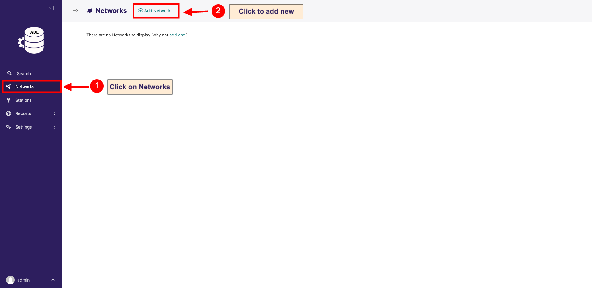

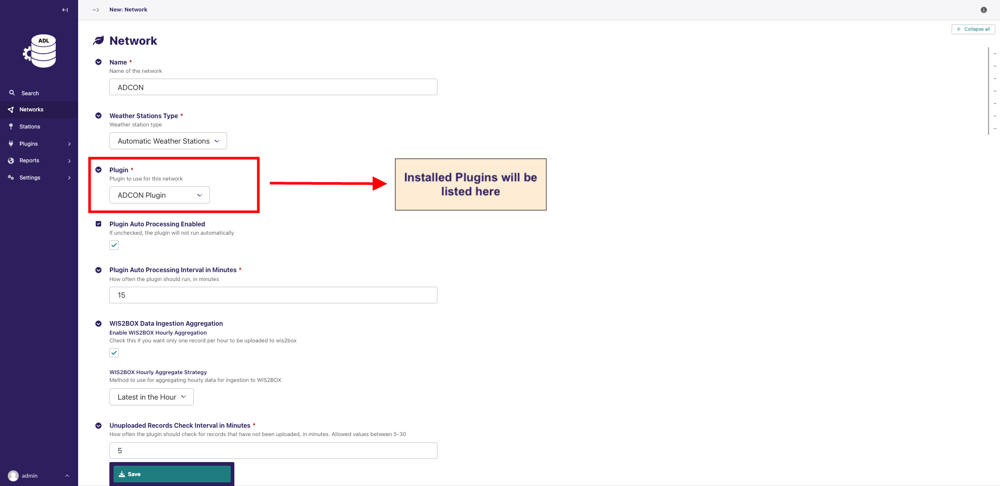

On the Plugin dropdown, select the `ADCON plugin`

#### The following fields control how the plugin will be processing data:

- **Plugin Auto Processing Enabled**: This is a boolean field that determines if the plugin is active and should be
  ingesting data

- **Plugin Auto Processing Interval**: This is the interval in minutes that the plugin should check for new data to
  ingest. Default is 15 minutes. You can update this to the required interval.

- **Enable WIS2Box Hourly Aggregation**: This is a boolean field that determines if the plugin should aggregate data
  that is ingested into a wis2box node on an hourly basis. This is in-support of the `GBON` requirement that requires
  data to be transmitted to the WIS2.0 system in an hourly intervals. If this is enabled, the plugin will aggregate data
  pushed into wis2box node into an hourly interval depending on the selected method.

- **WIS2Box Hourly Aggregation Method**: This is the method that will be used to aggregate data into an hourly
  interval. Currently, the method `Latest in the Hour` is implemented. This method will take the latest data point in
  the hour and use it as the hourly data point. Other methods like `averaging` can be implemented in the future.

- **UnUploaded Records Check Interval in Minutes**: This is the interval in minutes that the plugin should check for
  records, that for some reason (like the wis2box node being down), were not uploaded to the WIS2Box node. This is to
  ensure that all that was collected is pushed to wis2box. This also ensures that hourly aggregation data is ingested
  into wis2box.

Click on the `Save` button after filling in the required fields.

### 2. Add Stations to a Network

After creating a network, you can add stations to the network. Stations are the actual AWS stations or manual stations.

> Stations added to ADL are expected to be already added to your wis2box node, to be able to ingest data from them.

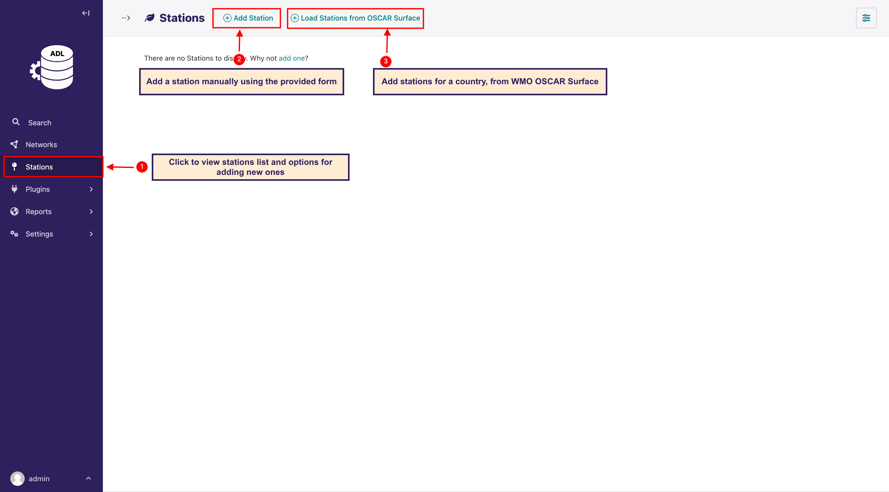

Please refer to the [WIS2Box ADL](https://github.com/wmo-raf/wis2box-adl) documentation for more detailed information on
options for adding stations.

In this guide, we are going to load stations from the [OSCAR Surface](https://oscar.wmo.int/surface) option.

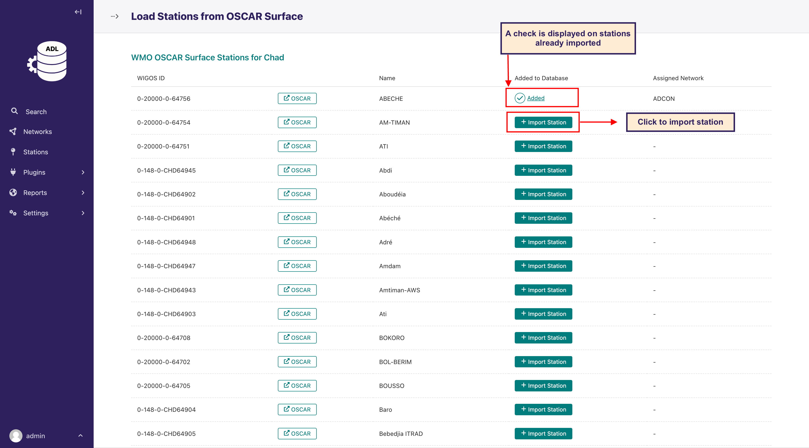

From the OSCAR Stations list, find the stations you want to add to the network and click on the `Import` button.
This will open the import form for the station as below:

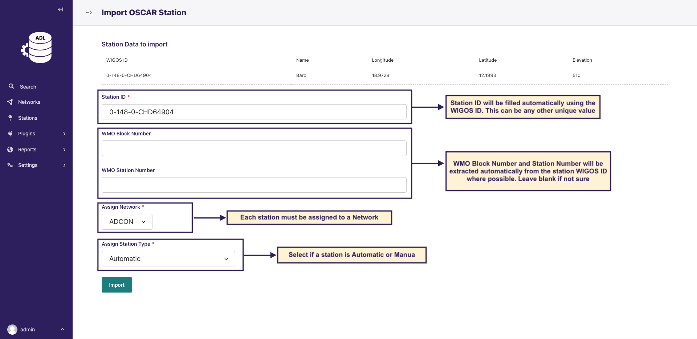

Here you will be required to set the `Staton ID` and assign the station to a network and select if the station is an AWS
station or manual.

Added stations will be listed when you click on the `Stations` link on the left sidebar.

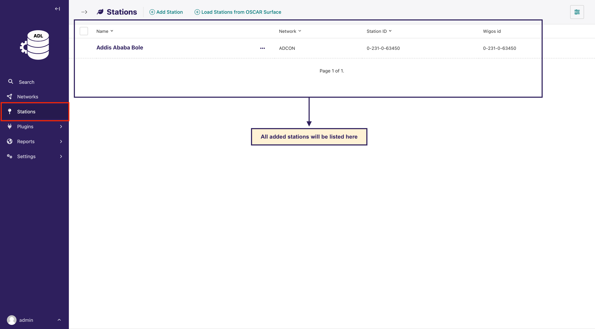

### 3. Plugin Configuration

To start ingesting data from the stations, you need to configure the plugin associated with the network.

If the `ADCON Plugin` was installed correctly, you should see `ADCON` in the `Plugins` list.

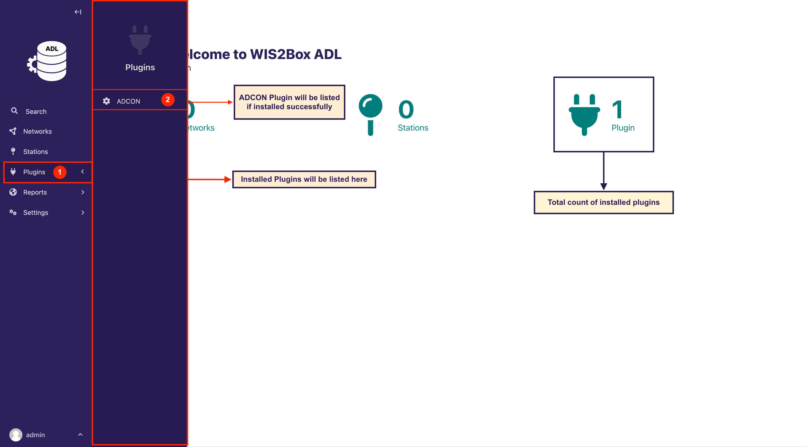

Click on the `ADCON` plugin will open the plugin configuration links as below:

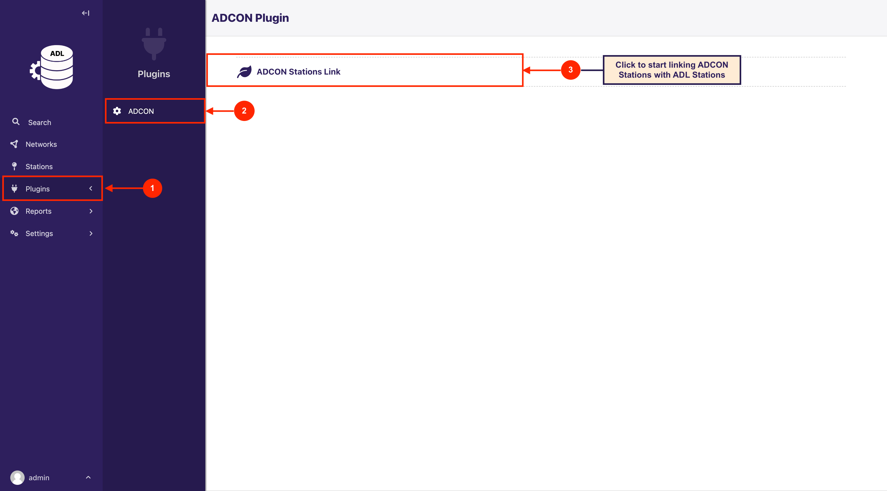

For the ADCON Plugin, we need to do the following configurations:

1. **Link Stations** For each station added from OSCAR Surface, you need to connect it to the corresponding station in
   the ADCON database.
2. **Link Data Parameters** For each `linked station`, you need to link the data parameters that you want to ingest from
   the ADCON database.

#### Link Stations

ADCON keeps its record of stations in its database. ADL has no knowledge of these stations. We only
added OSCAR stations. To be able to use the plugin to ingest data from the ADCON database, we need to link the ADL OSCAR
Station to the corresponding station in the ADCON database.

After clicking on the `ADCON Stations Link` link, you will see a button to add a new `ADCON Station Link`.

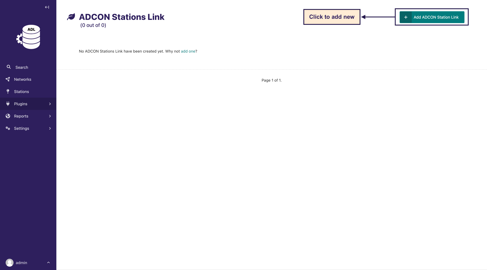

Clicking on the `Add ADCON Station Link` will open the form to link the ADL station to the ADCON station.

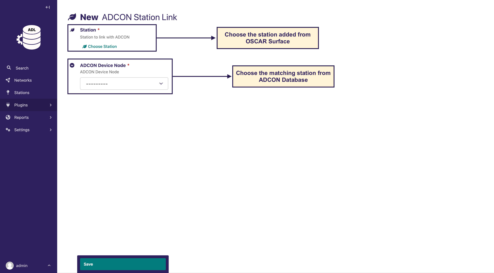

The top `Station` field is where you choose the ADL station that you want to link to the ADCON station.

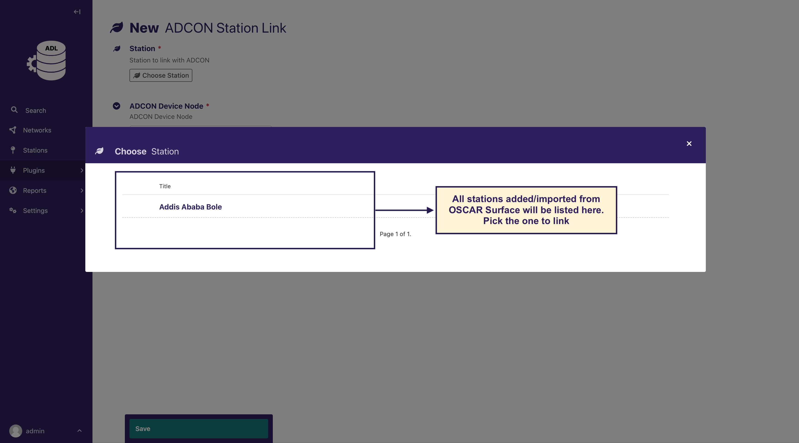

The bottom `ADCON Device Node` field is where you choose the corresponding ADCON station.

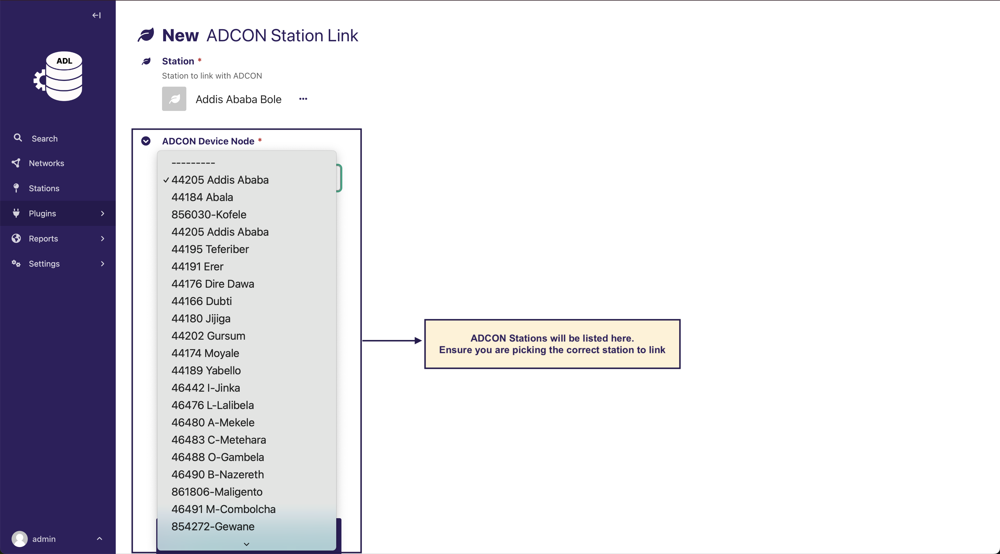

If the `ADCON` station dropdown is empty, you might need to adjust a setting that applies a filter to the stations
database query.

You can find it under the `Settings` link on the left sidebar and then click on the `ADCON Settings`.

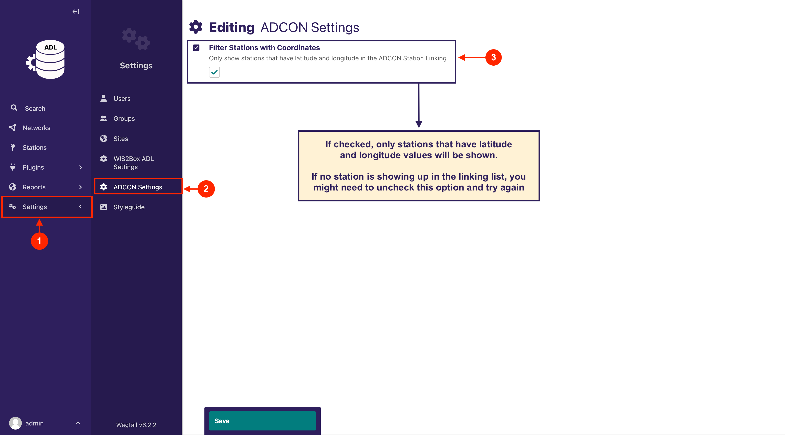

The `Filter Stations with Coordinates` is a check that filters the stations that have coordinates. This is helpful when
you have a mix of stations with and without coordinates in the ADCON database. If the ADCON stations dropdown is empty,
you can uncheck this setting and try again.

Ensure that you have matched an ADL station to expected corresponding ADCON station before saving.

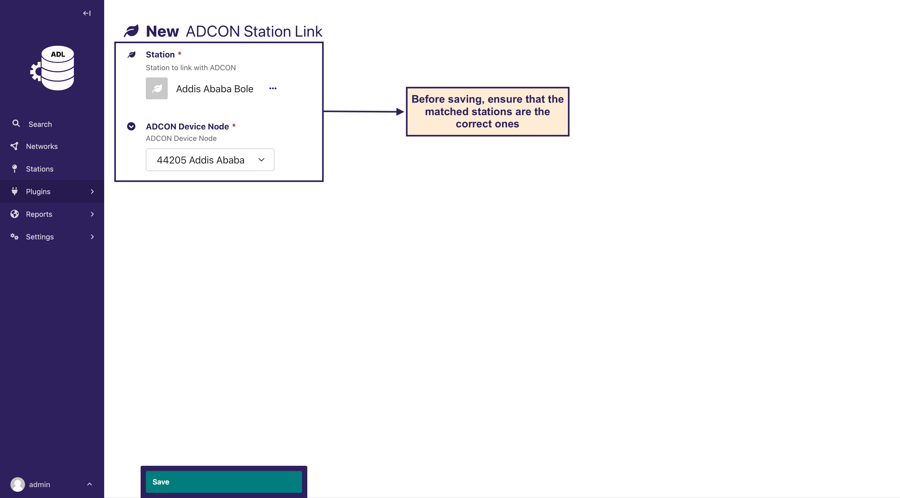

If successful, the linked stations will be listed on the `ADCON Stations Link` page.

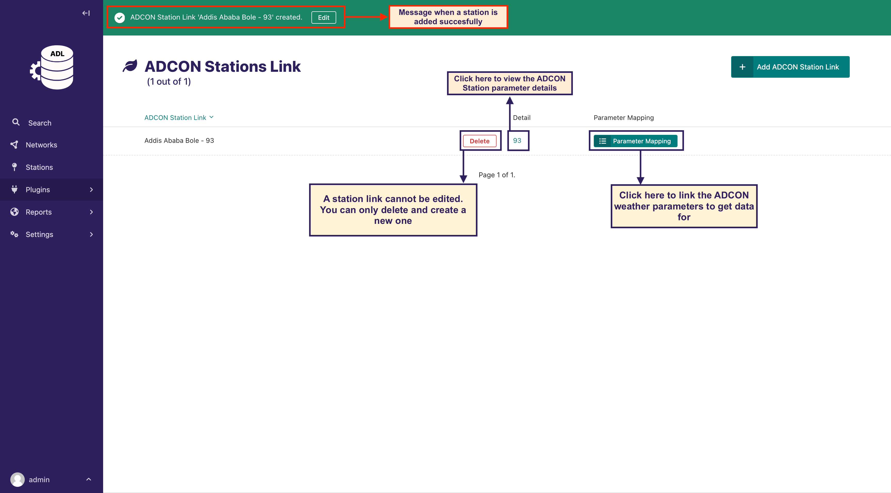

#### Link Data Parameters

Linking data parameters is the process of telling the plugin which data parameters to ingest from the ADCON database for
each linked station.

ADCON internally assigns data parameters to each station using a foreign key. Essentially, each data parameter is linked
to a station with unique ID that is not linked to any other station.

This limits us in a way that we can not do a bulk mapping of data parameters to the linked stations. Instead we have to
do it station by station

Clicking on the Linked Station `detail` ID will open a page with a list of data parameters monitored by the specific
ADCON Station.

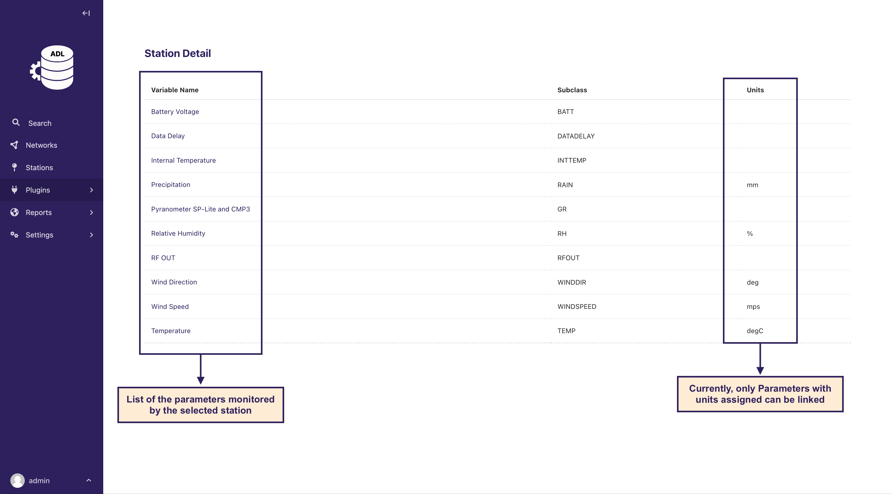

> It is important to note that currently you can only link data parameters that have units assigned to them.
> Currently,the units assignment is done internally based on some knowledge of the ADCON database schema. In coming
> updates, a more robust way of assigning units to data parameters will be implemented.


Click on the `Parameter Mapping` button to open the list page of the linked data parameters.

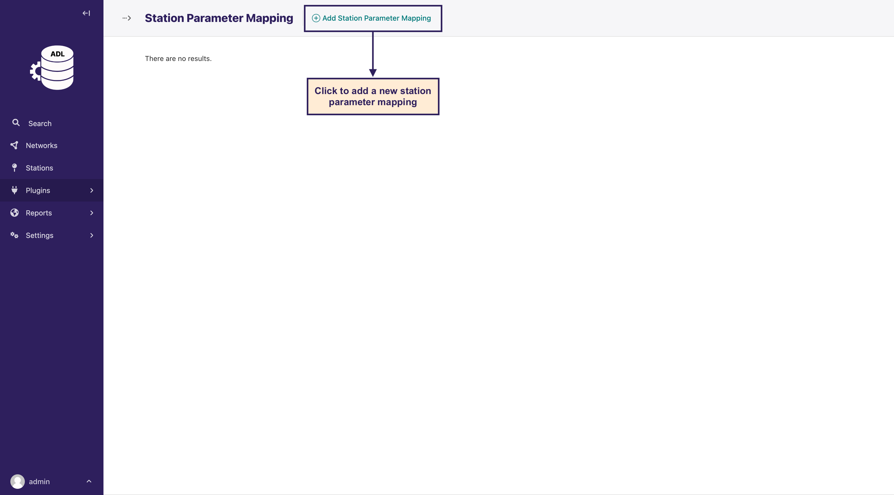

Click on `Add Station Parameter Mapping` to add a new data parameter mapping.

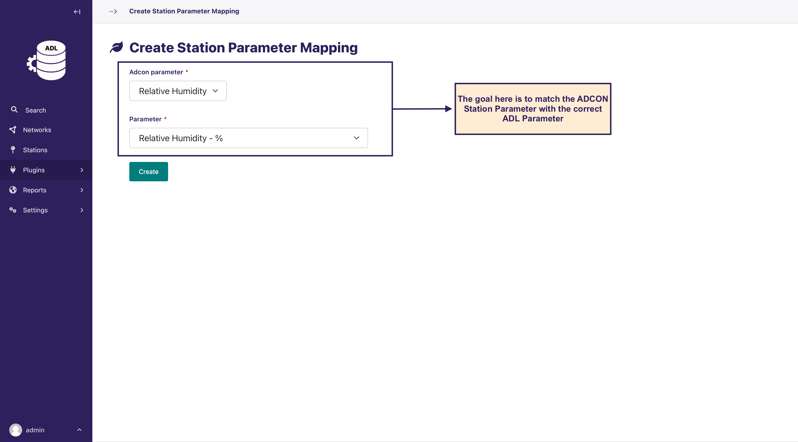

In this form, we have two fields:

##### ADCON Parameter

This is the data parameter as pulled from the ADCON database. This is a dropdown list of all the
data parameters that are monitored by the ADCON station, limited to parameters that can be currently connected to ADL

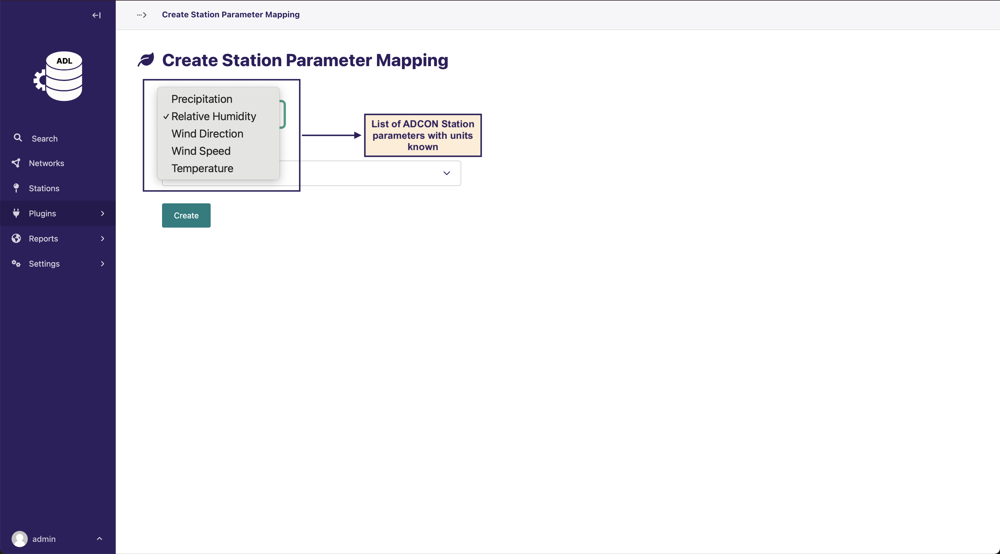

##### Parameter

This is the data parameter as defined in the ADL system. This is a predefined list of data parameters ,
based on the [wis2box AWS CSV Template](https://training.wis2box.wis.wmo.int/csv2bufr-templates/aws-template/).

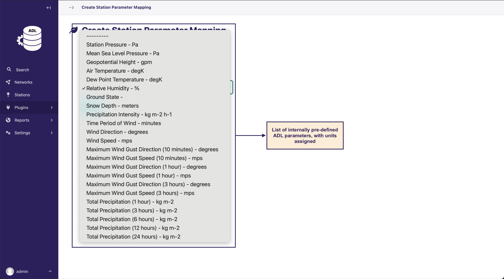

The AWS Template uses a standardized CSV format to ingest data from Automatic Weather Stations in support of GBON
reporting requirements. This mapping template converts CSV data to BUFR sequence 301150, 307096.

The AWS template format is intended for use with automatic weather stations reporting a minimum number of parameters,
including pressure, air temperature and humidity, wind speed and direction and precipitation on an hourly basis.

The data parameters in the template were extracted to form the predefined list of data parameters in the ADL system.

These include:

| Parameters                             | Units      | Description                                                                                                                                                                                  |
|----------------------------------------|------------|----------------------------------------------------------------------------------------------------------------------------------------------------------------------------------------------|
| station_pressure                       | Pa         | Pressure observed at the station level to the nearest 10 pascals                                                                                                                             |
| msl_pressure                           | Pa         | Pressure reduced to mean sea level to the nearest 10 pascals                                                                                                                                 |
| geopotential_height                    | gpm        | Geoptential height expressed in geopotential meters (gpm) to 0 decimal places                                                                                                                |
| air_temperature                        | Kelvin     | Instantaneous air temperature to 2 decimal places                                                                                                                                            |
| dewpoint_temperature                   | Kelvin     | Instantaneous dew point temperature to 2 decimal places                                                                                                                                      |
| relative_humidity                      | %          | Instantaneous relative humidity to 0 decimal place"                                                                                                                                          |
| ground_state                           |            | State of the ground encoded using code table 0 20 062                                                                                                                                        |
| snow_depth                             | meters     | Snow depth at time of observation to 2 decimal places                                                                                                                                        |
| precipitation_intensity                | kg m-2 h-1 | Intensity of precipitation at time of observation to 5 decimal places                                                                                                                        |
| time_period_of_wind                    | minutes    | Time period over which the wind speed and direction have been averegd. 10 minutes in normal cases or the number of minutes since a significant change occuring in the preceeding 10 minutes. |
| wind_direction                         | degrees    | Wind direction (at anemometer height) averaged from the cartesian components over the indicated time period, 0 decimal places                                                                |
| wind_speed                             | mps        | Wind speed (at anemometer height) averaged from the cartesian components over the indicated time period, 1 decimal place                                                                     |
| maximum_wind_gust_direction_10_minutes | degrees    | Highest 3 second average over the preceeding 10 minutes, 0 decimal places                                                                                                                    |
| maximum_wind_gust_speed_10_minutes     | mps        | Highest 3 second average over the preceeding 10 minutes, 1 decimal place                                                                                                                     |
| maximum_wind_gust_direction_1_hour     | degrees    | Highest 3 second average over the preceeding hour, 0 decimal places                                                                                                                          |
| maximum_wind_gust_speed_1_hour         | mps        | Highest 3 second average over the preceeding hour, 1 decimal place                                                                                                                           |
| maximum_wind_gust_direction_3_hours    | degrees    | Highest 3 second average over the preceeding 3 hours, 0 decimal places                                                                                                                       |
| maximum_wind_gust_speed_3_hours        | mps        | Highest 3 second average over the preceeding 3 hours, 1 decimal place                                                                                                                        |
| total_precipitation_1_hour             | kg m-2     | Total precipitation over the past hour, 1 decimal place                                                                                                                                      |
| total_precipitation_3_hours            | kg m-2     | Total precipitation over the past 3 hours, 1 decimal place                                                                                                                                   |
| total_precipitation_6_hours            | kg m-2     | Total precipitation over the past 6 hours, 1 decimal place                                                                                                                                   |
| total_precipitation_12_hours           | kg m-2     | Total precipitation over the past 12 hours, 1 decimal place                                                                                                                                  |
| total_precipitation_24_hours           | kg m-2     | Total precipitation over the past 24 hours, 1 decimal place                                                                                                                                  |

It is important to make sure the correct data parameter is selected for the ADCON parameter and the corresponding ADL
parameter. This will determine the correctness of the data extracted and mapped to the template for ingesting data into
wis2box.

After selecting the parameters, click on the `Save` button to save the mapping.

The currently added `Station Parameter Mappings` will be listed on the `Parameter Mapping` page.

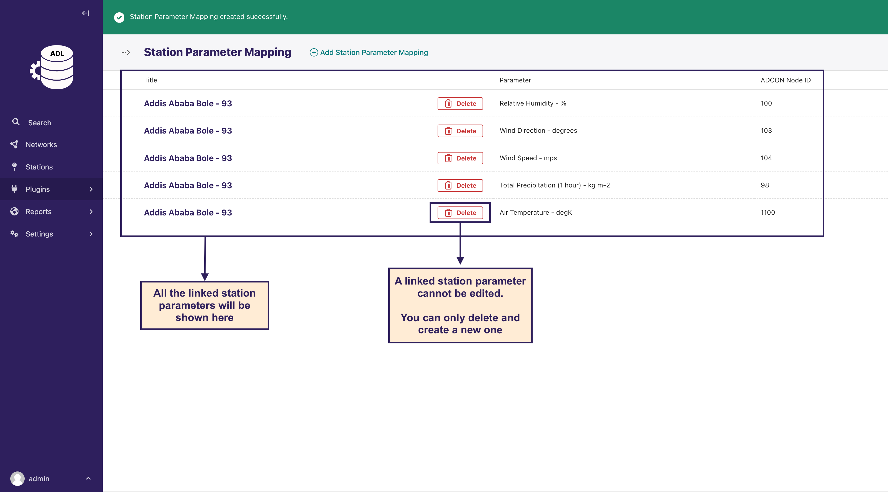

You can add as many data parameters as you required for each linked station.

If correctly added, the plugin will start ingesting data from the ADCON database for the linked stations, using the
settings defined earlier on the Network.

You can adjust the Network settings to change the ingestion interval or disable hourly aggregation.

Currently, no internal monitoring service is set on the ADL System. This will be implemented in future updates.

You can use the `wis2box monitoring services` to check if data is coming in as expected.

### Troubleshooting

##### 1. No ADCON Stations in the dropdown

Uncheck the `Filter Stations with Coordinates` setting in the `ADCON Settings` page and try again.

##### 2. No data being ingested

Check the logs for the `wis2box_adl_celery_worker` service to see if there are any errors. A common error is data not
being uploaded to the wis2box node. Please confirm that the following environment variables are set correctly:

```sh
WIS2BOX_CENTRE_ID= # ensure that you set the correct centre ID as set in wis2box
WIS2BOX_STORAGE_ENDPOINT=<wis2box_ip>:9000 # this is the IP address of the wis2box node minio service
WIS2BOX_STORAGE_USERNAME= # get this from wis2box.env of your wis2box installation
WIS2BOX_STORAGE_PASSWORD=# get this from wis2box.env of your wis2box installation
```

Confirm that `WIS2BOX_STORAGE_ENDPOINT` is reachable from inside the container


